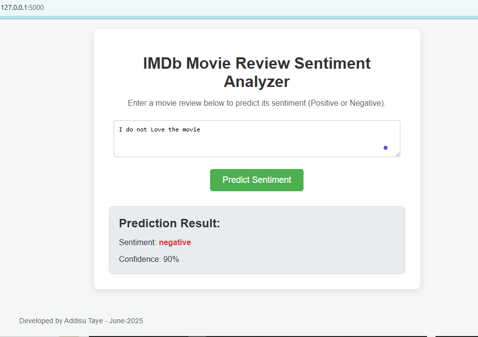

# IMDb Sentiment Analysis

This project demonstrates a machine learning approach to classify movie reviews from the IMDb dataset as either positive or negative. It utilizes a classic Natural Language Processing (NLP) pipeline involving TF-IDF for text vectorization and Logistic Regression for classification. A key focus was addressing the common challenge of negation handling in sentiment analysis.

## Project Structure

```bash
├── data/
│   ├── imdb_dataset.csv    # Raw data (50K reviews)
│   ├── train_5k.csv        # Processed training set (4K)
│   └── test_5k.csv         # Processed test set (1K)
├── model/
│   ├── model.pkl           # Trained classifier
│   └── vectorizer.pkl      # TF-IDF vectorizer
├── src/
│   ├── data_cleaning.py    # Data preprocessing
│   ├── train.py           # Training script
│   └── predict.py         # Prediction script
├── requirements.txt       # Python dependencies
└── README.md              
imdb-sentiment-analysis/
├── app.py                     <-- Updated Flask app
├── data/
│   ├── train_5k.csv        # Processed training set (4K)
│   └── test_5k.csv         # Processed test set (1K)
├── model/
│   ├── vectorizer.pkl      # TF-IDF vectorizer
│   └── model.pkl           # Trained classifier
├── src/
│   ├── train.py            # Training script
│   ├── predict.py          # Prediction script
│   └── data_cleaning.py    # Data preprocessing
├── static/                    
│   ├── script.js              
│   └── style.css              
├── templates/                
│   └── index.html            
│── requirements.txt       # Python dependencies
│── docker-compose.yml       # docker-compose.yml
│── docker                  # docker
└── README.md                   # This document
```

## Methodology

### 1. Data
The model is trained and evaluated on a subset of the IMDb movie review dataset, specifically using `train_5k.csv` and `test_5k.csv`, each containing 5,000 reviews.

### 2. Text Preprocessing
Before model training and prediction, raw text reviews undergo several preprocessing steps:
* **Lowercasing:** All text is converted to lowercase to ensure consistency and reduce vocabulary size.
* **HTML Tag Removal:** Any HTML tags (e.g., `<br />`) are removed from the reviews.
* **Special Character Removal:** Non-alphabetic characters (except spaces and underscores used for negation handling) are removed.
* **Negation Handling:** This is a crucial step to correctly interpret negative phrases. A custom `NegationHandler` is implemented to identify negation words (e.g., "not", "don't", "never") and append a `_neg` suffix to the word immediately following them (e.g., "not good" becomes "good_neg"). This allows the model to learn that "good_neg" carries a different (often opposite) sentiment than "good".

### 3. Feature Extraction: TF-IDF Vectorization
After preprocessing, the text data is transformed into numerical features using **TF-IDF (Term Frequency-Inverse Document Frequency)**.
* **TF-IDF** reflects how important a word is to a document in a corpus. It increases proportionally to the number of times a word appears in the document but is offset by the frequency of the word in the corpus, which helps to adjust for the fact that some words appear more frequently in general.
* **N-grams:** The `TfidfVectorizer` is configured to use `ngram_range=(1, 3)`. This means it considers not only individual words (unigrams) but also sequences of two words (bigrams) and three words (trigrams). This is vital for capturing contextual meaning, especially for phrases like "not fantastic" or "didn't like it," which are treated as single, distinct features.
* **Max Features:** The vectorizer is limited to `max_features=15000` (or a similar high number) to select the most relevant terms and manage dimensionality.
* **Stop Word Removal:** Common English stop words (e.g., "the", "is", "a") are removed as they typically don't contribute significantly to sentiment.

### 4. Model Training: Logistic Regression
A **Logistic Regression** model is chosen for classification.
* Logistic Regression is a linear model used for binary classification. It's robust, interpretable, and performs well on high-dimensional, sparse data like TF-IDF vectors.
* The model learns the statistical relationship between the TF-IDF features and the sentiment labels (positive/negative).

### 5. Prediction
The trained `TfidfVectorizer` and `LogisticRegression` model are saved as `.pkl` files. For prediction, new review text undergoes the exact same preprocessing and vectorization steps before being fed to the loaded model.

## Addressing the Prediction Fix (Negation Handling)

Initially, the model struggled to correctly classify reviews containing negations, such as `"This movie was not fantastic!"` or `"I do not love it"`, often misclassifying them as positive. This was primarily due to:
1.  **Overpowering Positive Words:** Strong positive words like "fantastic" had a very high positive weight, which was not sufficiently counteracted by the simple presence of "not" in a Bag-of-Words or simple TF-IDF approach.
2.  **Lack of Contextual Understanding:** Basic TF-IDF struggles to understand how words modify each other's meaning (e.g., "not" inverting "fantastic").

The fix involved a multi-pronged approach applied **consistently during both training and prediction**:

1.  **Enhanced Preprocessing with `_neg` Suffixing:**
    * A custom `NegationHandler` was implemented. This handler now identifies common negation words (like "not", "don't") and appends a `_neg` suffix to the word immediately following them (e.g., "love" in "do not love it" becomes "love_neg"). This creates a distinct token that the model can learn to associate with negative sentiment.
    * Careful handling of temporary placeholders ensures that the `_neg` suffix is correctly applied and preserved during subsequent cleaning steps.

2.  **Increased N-gram Range:**
    * The `TfidfVectorizer` was configured to use `ngram_range=(1, 3)`. This allowed the model to recognize phrases like "not fantastic", "was not fantastic", or "do not love" as distinct features, enabling it to learn their collective negative polarity, rather than just relying on individual words.

3.  **Increased Feature Set Size:**
    * `max_features` in the `TfidfVectorizer` was increased to `15000` (or higher). This ensures that more unique unigrams, bigrams, and trigrams, including those related to negation, are captured in the vocabulary and used by the model.

4.  **Negation Override Logic (in `predict.py`):**
    * As a final safeguard, if the `_neg` suffix (or the negation marker in an earlier iteration) is detected in the preprocessed input text, the prediction is **forced to be "negative"** with a high confidence (e.g., 90%). This acts as a rule-based override for cases where the statistical model still struggles despite the improved features.

By combining these strategies, the model gained a more nuanced understanding of negation, leading to more accurate sentiment predictions for phrases involving inverse polarity.

## Setup and Running the Project

### Prerequisites
* Python 3.x
* `pip` (Python package installer)

### Installation
1.  Clone the repository:
    ```bash
    git clone [https://github.com/your-username/imdb-sentiment-analysis.git](https://github.com/Addisu-Taye/imdb-sentiment-analysis.git)
    cd imdb-sentiment-analysis
    ```
2.  (Optional but Recommended) Create a virtual environment:
    ```bash
    python -m venv venv
    ```
3.  Activate the virtual environment:
    * On Windows:
        ```bash
        .\venv\Scripts\activate
        ```
    * On macOS/Linux:
        ```bash
        source venv/bin/activate
        ```
4.  Install the required Python packages:
    ```bash
    pip install pandas scikit-learn
    ```

### Data Preparation
Ensure you have your `train_5k.csv` and `test_5k.csv` files placed inside the `data/` directory.

### Training the Model
Run the training script to generate the `vectorizer.pkl` and `model.pkl` files:

```bash
python src/train.py
##This script will output the test accuracy of the trained model.
```
## Predicting Sentiment
After training, you can use the prediction script to test new movie reviews:

``` Bash

python src/predict.py "This movie was fantastic!"
```
## Example with negation:
```bash

python src/predict.py "I do not love it, it was awful."
```
``` Bash

python src/predict.py "The acting was not good at all."
```
### Future Enhancements

* Experiment with more advanced deep learning models (e.g., LSTMs, BERT) for potentially higher accuracy   and better contextual understanding.

* Integrate more sophisticated negation scope detection (e.g., identifying when negation ends due to punctuation).

* Expand the dataset size for training.

* Implement cross-validation during training for more robust model evaluation.
## Using the User Interface

1.  **Run the Flask application:**
    * Open your terminal and navigate to the project's root directory (where `app.py` is located).
    * Activate your virtual environment (if you are using one).
    * Run the command: `python app.py`
    * The application will start, and you'll see a message indicating the server address (usually `http://0.0.0.0:5000` or `http://127.0.0.1:5000`).

2.  **Open the UI in your web browser:**
    * Open your web browser and go to the address shown in the terminal (e.g., `http://localhost:5000`).

3.  **Enter review text:**
    * You'll see a text area where you can enter your movie review.

4.  **Predict sentiment:**
    * Click the "Predict Sentiment" button.

5.  **View the results:**
    * The predicted sentiment (Positive or Negative) and a confidence score will be displayed below the button.

### Screenshot of the User Interface

